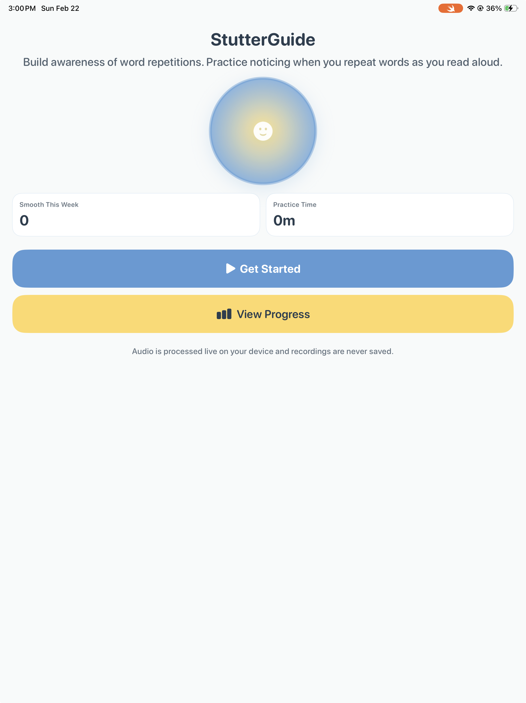
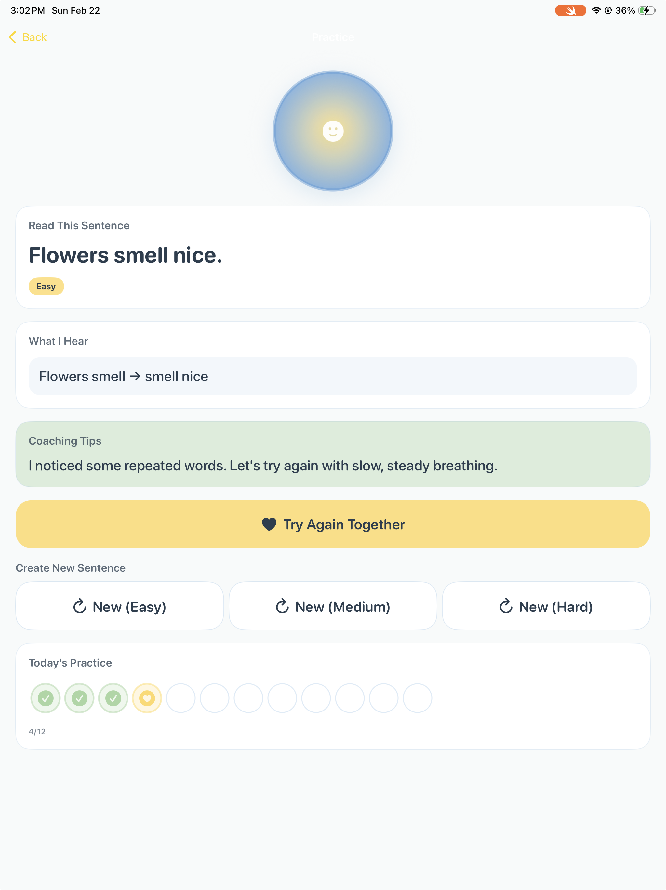
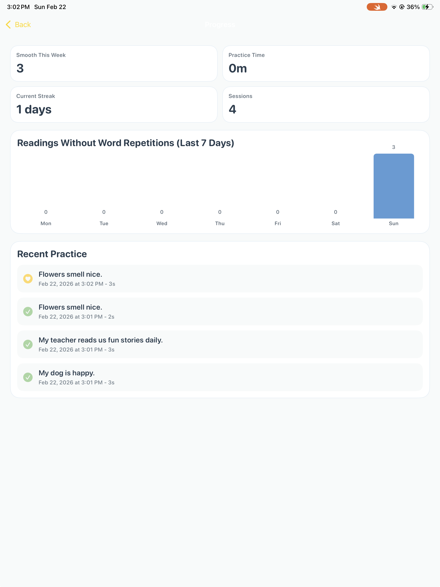

# StutterGuide

**Swift Student Challenge 2026 Winner** 🏆

An iOS app that helps children who stutter build awareness of word repetitions through real-time speech recognition.

## About

StutterGuide provides a safe, judgment-free space for practicing reading aloud. The app listens as you read sentences and gently identifies when you repeat words (like "the the dog"), helping build awareness of speech patterns.

Built from personal experience: at age 3, I couldn't speak like other kids and spent years in remedial speech classes. This is the patient companion I needed back then.

## Features

- **Real-time word repetition detection** using Apple's Speech framework
- **AI-powered sentence generation** with Foundation Models (offline fallback included)
- **Privacy-first:** All audio processed on-device, no recordings saved
- **Progress tracking:** Weekly stats, streaks, and practice history
- **Accessibility:** VoiceOver support, Dynamic Type, works completely offline

## Tech Stack

- [SwiftUI](https://developer.apple.com/swiftui/)
- [Speech framework](https://developer.apple.com/documentation/speech) (on-device recognition)
- [SwiftData](https://developer.apple.com/documentation/swiftdata/) (local persistence)
- [Foundation Models](https://developer.apple.com/documentation/FoundationModels) (sentence generation)
- [Charts](https://developer.apple.com/documentation/charts) (progress visualization)

## Requirements

- iOS 18.0+
- Xcode 16+
- Microphone and Speech Recognition permissions

## Running the Project

1. Open `StutterGuide.swiftpm` in Xcode
2. Grant microphone and speech recognition permissions when prompted
3. Run on iPad device for best experience

## Architecture Highlights

- **Privacy-first design:** No network calls, all processing on-device
- **Observable pattern** for clean state management
- **Modular services layer** (`SpeechManager`, `PracticeManager`, `SentenceManager`)
- **SwiftData** for local-only data persistence

## Screenshots

  
  
  

